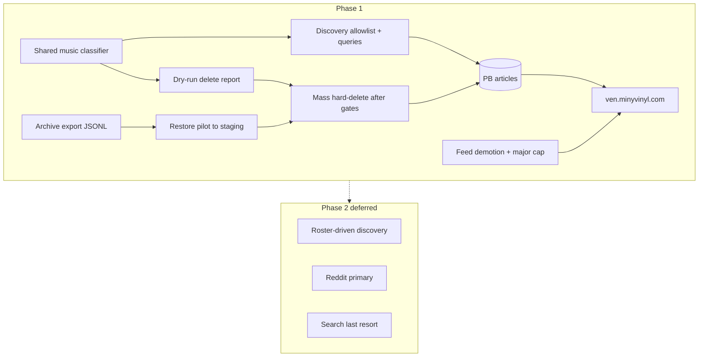

# feat: Indie music feed cleanup and discovery quality

## Summary

Stop non-music and open-web discovery junk from defining VEN’s public feed. Phase 1: (1) a high-precision shared music classifier, (2) archive export + proven restore pilot, (3) gated hard-delete of non-music / generic discovery noise, (4) allowlist + music-intent queries on all open-web discovery writers, (5) invert major-press soft-rank, fetch `curated`, and enforce a first-screen major cap. Phase 2 pipeline (roster / Reddit primary / search last) is deferred.

## Problem Frame

Origin (see `docs/brainstorms/2026-07-21-indie-music-feed-cleanup-requirements.md`): ~47k PB articles; newest pages polluted by SearXNG/Brave Discovery including non-music; majors boosted by client `sourceRank`; product intent is music-only then indie-discovery-first. Prior client soft-rank toward NME/Billboard was a temporary bandage that conflicts with K3.

## Requirements Trace

| Origin | Plan coverage |
|--------|----------------|
| R1–R6, S4–S6 | U1, U2, U3 |
| R7–R12, S1, S2a | U5 |
| R13–R17, S3 | U1, U4 |
| D1–D5 (phase 2) | Deferred section only |
| G1–G5, K1–K5 | All phase-1 units |

## Key Technical Decisions

| Decision | Choice | Rationale |
|----------|--------|-----------|
| Classifier home | Shared module under `scraper/` reused by cleanup CLI and discovery write path | Origin A3; existing keyword lists in `generate_music_cities.py` / `rss_scraper.is_music_relevant` are weak alone—extract, tighten, dual-threshold |
| Delete threshold vs ingest | High-precision delete; ingest may quarantine/reject | Origin R16 split thresholds; avoid over-delete under S1 pressure |
| Archive medium | JSONL dump (one article JSON per line) + manifest checksums; path configurable via env | Simple restore; PB archive step is currently a no-op (`archive_stale_articles` skipped) |
| Feed demotion | Client invert of `sourceRank` + fetch `curated` + hard first-25 major cap | Fast ship; optional server `filter` later (O4) without blocking phase 1 |
| Discovery allowlist | Config file (YAML or Python const) fail-closed; apply to Brave, DDGS, SearXNG, Perplexity/Librarium discovery writers if active | Origin R13–R14; G4 fails if only Brave is gated |
| Mass delete gate | No bulk delete until S5 pilot restore + S6 retention pass | Feasibility/adversarial review critical findings |

## High-Level Technical Design

## Scope Boundaries

### In scope

- Classifier, archive/restore, gated delete, discovery ingest gates, public feed ranking/cap.

### Deferred to Follow-Up Work

- Phase 2 D1–D5 (roster, Reddit primary, search last, novel-domain quarantine).
- Server-side `feed_weight` field if client demotion proves insufficient.
- LLM classifier if keyword dual-threshold fails holdout.

### Outside

- Rewriting majors into original copy; Firebase; general news product.

## Implementation Units

### U1. Shared music classifier with dual thresholds

**Goal:** One versioned “music enough” definition for cleanup and discovery writes, with separate high-precision delete vs write-time reject bars.

**Requirements:** R6, R16–R17, S6 (see origin)

**Dependencies:** none

**Files:**
- Create: `scraper/music_classifier.py`
- Modify: `scraper/rss_scraper.py` (call shared classifier from discovery paths)
- Modify: `scraper/generate_music_cities.py` (optional reuse of keyword lists)
- Create: `scraper/tests/test_music_classifier.py` (or project’s existing test layout under `scraper/`)

**Approach:**
- Extract/extend `has_music_content` / `has_non_music_content` and `is_music_relevant` into a single module with pure functions: `classify(title, summary, source, *, mode)` → `music | non_music | uncertain`.
- `mode=delete`: only `non_music` is deletable; `uncertain` kept for holdback.
- `mode=ingest`: reject `non_music`; optional quarantine of `uncertain` (log + skip live write).
- Do not treat `source_genre in ('gospel','mixed')` as automatic music without content check (current failure mode).
- Seed unit tests from labeled examples: clear music, clear non-music (hotel fire, sports), borderline (Apple Music pricing).

**Patterns to follow:** Existing keyword blocks in `scraper/generate_music_cities.py`; discovery call sites in `scraper/rss_scraper.py` (`is_music_relevant`).

**Test scenarios:**
- Happy: music title+summary → `music` for both modes.
- Happy: non-music hotel fire → `non_music`.
- Edge: empty summary, music source → still uses title; uncertain if no signal.
- Edge: discovery source with weak keywords that currently false-positive → not `music` under delete mode without strong signal.
- Error: None expected for pure functions.

**Verification:** Unit tests pass; dry-run sample of 200 live titles produces a human-readable breakdown (music/non_music/uncertain counts).

---

### U2. Archive export and restore pilot tooling

**Goal:** Recoverable archive of rows selected for removal; prove restore before mass delete.

**Requirements:** R1, S5 (see origin)

**Dependencies:** U1 (selection uses classifier)

**Files:**
- Create: `scraper/archive_articles.py` (or `scraper/tools/archive_articles.py`)
- Create: `scraper/tests/test_archive_articles.py`
- Document path convention in `scraper/README` or `RUNBOOK.md` if present

**Approach:**
- Export selected PB records as **JSONL** + `manifest.json` (`count`, `sha256` of file, filter description, timestamp).
- Selection modes: `--dry-run-classify` (list IDs only), `--export-non-music`, `--export-ids-file`.
- Restore pilot: re-create records into a **staging** collection or staging PB instance (config via env); reconcile id set and count. Do not restore into production without explicit flag.
- Never call hard-delete from this unit.

**Test scenarios:**
- Happy: export N fixture records → JSONL line count N; manifest matches.
- Happy: restore pilot loads N rows into mock/stub PB client with matching IDs.
- Error: missing PB token / network failure aborts without partial delete.
- Edge: empty selection writes empty archive + manifest count 0.

**Verification:** One real pilot batch exported from production (read-only classify) and restored to staging with zero silent field loss.

---

### U3. Dry-run delete report and gated mass hard-delete

**Goal:** Operators can review proposed deletes, pass S6 retention, then execute archive+delete with audit log.

**Requirements:** R2–R5, R17, S4, S6 (see origin)

**Dependencies:** U1, U2

**Files:**
- Create: `scraper/cleanup_non_music.py`
- Create: `scraper/tests/test_cleanup_non_music.py`

**Approach:**
- Commands: `report` (CSV/JSON of proposed deletes with scores), `holdout-check` (against labeled file), `execute` (requires `--i-understand` + path to verified archive manifest).
- `execute` flow: re-verify archive exists and checksum matches selection → delete by id batches → write audit log (`deleted_count`, `ids`, archive path).
- Curated rows never auto-deleted (R2/R3).
- Default batch size and sleep to avoid PB rate limits.

**Test scenarios:**
- Happy: report lists only `non_music` mode results for fixtures.
- Happy: execute with valid archive mock deletes only listed IDs.
- Error: execute without archive checksum match refuses.
- Edge: curated non_music appears in holdback list not execute list.

**Verification:** Holdout retention ≥ agreed threshold; production execute only after explicit ops sign-off documented in audit log.

---

### U4. Discovery ingest allowlist and music-intent queries

**Goal:** Stop new open-web discovery pollution (SearXNG, Brave, DDGS, peers).

**Requirements:** R13–R16, S3 (see origin)

**Dependencies:** U1

**Files:**
- Create: `scraper/config/music_domain_allowlist.txt` (or `.yaml`)
- Modify: `scraper/rss_scraper.py` (Brave/DDGS/other discovery save paths)
- Modify: discovery query lists in same file / related modules
- Create: `scraper/tests/test_discovery_allowlist.py`

**Approach:**
- Seed allowlist from music RSS hostnames + known indie domains (Obscure Sound, Quietus, Under the Radar, Bandcamp, Pitchfork, etc.—planning seeds list in config, not code comments only).
- Fail-closed: empty/missing allowlist disables discovery writers with loud log.
- Before save: domain of `source_url` must match allowlist **and** classifier `mode=ingest` not `non_music`.
- Retarget queries away from open “breaking news” toward music/indie phrases.
- Metrics: log accept/reject counts for S3 (candidates vs accepted).

**Test scenarios:**
- Happy: allowlisted music URL + music title → accept.
- Happy: non-allowlisted domain → reject even if title looks musical.
- Edge: missing allowlist file → discovery path no-ops / raises controlled skip.
- Edge: hotel-fire title on allowlisted domain → classifier reject.

**Verification:** Staging or dry-run scrape shows reject rate for non-music; no new “SearXNG Discovery” non-music rows after deploy.

---

### U5. Public feed demotion, curated field, major first-screen cap

**Goal:** Public UI never prioritizes majors; at most 2 uncurated major-wire rows in first 25; never show non-music if residual inventory remains.

**Requirements:** R7–R12, S1, S2a (see origin)

**Dependencies:** none (can parallel U1–U4); stronger after U3/U4 land

**Files:**
- Modify: `src/utils/articles.ts` (`ARTICLE_FIELDS`, `sourceRank`, optional `applyFeedPresentation`)
- Modify: `src/types/news.ts` (add `curated?: boolean` if needed)
- Modify: `src/App.tsx` / `src/hooks/useArticles.ts` only if presentation needs page-level logic beyond rank
- Create: unit tests colocated or under project test setup for `sourceRank` / presentation helper

**Approach:**
- Add `curated` to `ARTICLE_FIELDS` and map into article type.
- Invert ranks: specialty/community/curated high; generic mid; majors low; discovery noise lowest (or filtered out if source matches discovery labels).
- Apply **first-screen major cap**: when building display list for home/list, after rank, ensure first 25 contain ≤2 uncurated major-wire sources (skip extras further down the loaded page).
- Optional client filter: hide sources matching discovery noise labels if still present pre-delete.

**Patterns to follow:** Existing `sourceRank` / `rankArticles` in `src/utils/articles.ts`.

**Test scenarios:**
- Happy: mixed page ranks specialty above NME.
- Happy: 10 NME + 5 specialty → first 25 include specialty first and ≤2 NME unless curated.
- Edge: all majors curated → cap does not strip curated.
- Edge: discovery source labeled “SearXNG Discovery” ranks last / filtered.

**Verification:** Live cold load on `/list` after deploy: S2a holds on visual check; network shows single bounded PB page still (no full-corpus regression).

---

### U6. Ops runbook and phase-1 acceptance checklist

**Goal:** Operators can run cleanup safely and confirm S1/S2a/S3/S5/S6.

**Requirements:** R5, success criteria (see origin)

**Dependencies:** U1–U5

**Files:**
- Create or update: `docs/plans/` companion or `RUNBOOK.md` / `scraper/README` section “Indie feed cleanup”

**Approach:** Document order: classifier dry-run → export → restore pilot → holdout → execute → enable allowlist in prod scraper → deploy web demotion → 3-day S1 watch. Include env vars, who owns allowlist (O5), rollback (re-import from archive).

**Test expectation:** none — documentation unit.

**Verification:** Checklist completed once with named operator initials on pilot.

## Phased Delivery

1. **Week 1a — bleed stop:** U1 + U4 + U5 (can ship without mass delete).
2. **Week 1b — corpus surgery:** U2 + U3 after S5/S6 gates.
3. **Observe:** 3-day S1 window.
4. **Phase 2 (separate plan):** D1–D5 roster/Reddit/search.

## Risk Analysis & Mitigation

| Risk | Mitigation |
|------|------------|
| False-delete good music | Dual threshold; S6 holdout; curated holdback |
| Archive not restorable | S5 pilot required before execute |
| Allowlist freezes discovery | Phase 2 supply; optional quarantine later |
| S2a fails (too many majors residual) | Hard cap R9; optional later server filter |
| Week-1 over-scope | Ship 1a without mass delete if gates lag |

## Open Questions (planning defaults)

| ID | Default if unset |
|----|------------------|
| O1 major list | billboard, nme, rolling stone, variety, spin, pitchfork news wire labels as configured in rank demotion list |
| O2 Apple Music pricing | keep as music industry (music product) |
| O3 archive location | `archives/articles-YYYYMMDD/` outside web root or private storage path via env |
| O4 demotion | client first; revisit server weight if cap insufficient |
| O5 allowlist owner | scraper config owners / repo maintainers |
| O6 Reddit week-1 | **no** (full plan as requirements; not required for 1a) |

## Success Metrics

- S1, S2a, S3, S4, S5, S6 from origin (phase 1).
- S2b deferred to phase 2 plan.

## System-Wide Impact

- **Scraper:** discovery volume may drop (fail-closed allowlist)—monitor empty-feed risk; floor on accepted writes (S3).
- **Web:** ranking change affects home and list simultaneously via shared `fetchArticles` / rank helpers.
- **PB:** mass delete reduces collection size; backups still recommended beyond app-level archive.

## Sources & Research

- Origin requirements (reviewed 2026-07-21).
- Local: `scraper/rss_scraper.py` (`is_music_relevant`, Brave/DDGS discovery, `archive_stale_articles` no-op), `scraper/generate_music_cities.py` keyword filters, `src/utils/articles.ts` soft rank + omitted `curated`.
- Live observation: discovery sources dominate newest 200; soft-rank temporarily elevated majors.
